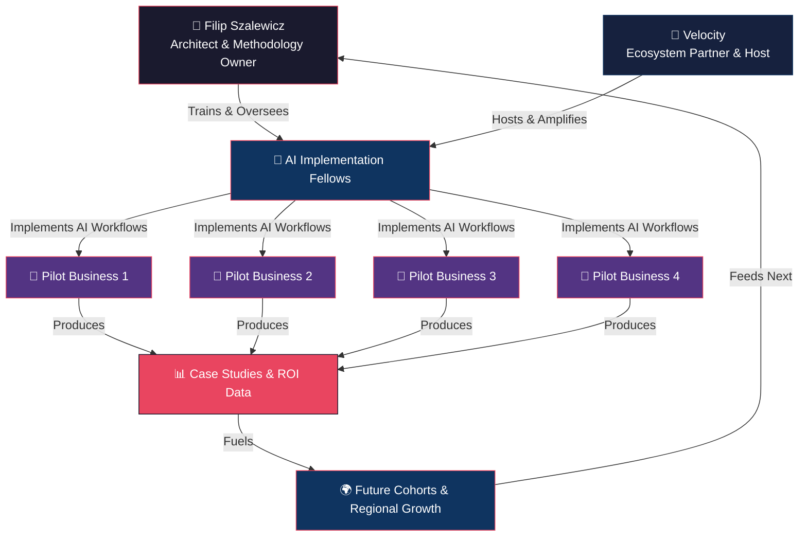

# 🧠 Operational Intelligence Lab

**Building real AI capability in regional businesses — not workshops, not theory, not hype.**

[](LICENSE)

---

## The Problem

Most AI initiatives in regional markets stop at workshops and training. They produce slides, not outcomes. Local businesses hear about AI everywhere but have no clear path to embed it into their operations in a way that moves the needle.

**Macomb County and SE Michigan don't have a Silicon Valley pipeline.** What they have is a dense fabric of industrial, service, and growth-stage businesses that would benefit enormously from operational AI — if someone actually built it with them.

## The Thesis

> **Rate of Improvement is everything.**
>
> Whatever use case we build with AI for any business — in any function — we measure the metric the business already cares about. The rate of improvement on that metric should accelerate rapidly at first, then taper and stabilize. As long as that curve holds, what we built is making a massive, compounding impact.

This repo exists to prove that thesis and give others the tools to replicate it.

## What This Is

**Operational Intelligence Lab** is an open playbook for deploying AI inside real businesses to improve real metrics. It contains:

- 📚 **Dual-track curriculum** — one for implementation Fellows, one for participating businesses
- 🧪 **Core methodology** — the Rate of Improvement framework, ROI modeling, and the OI operating model
- 🤖 **Prompts & skills library** — reusable, agent-ready prompts for business analysis, workflow design, and measurement
- 📋 **Templates** — intake questionnaires, progress reports, case studies, ROI reports
- 🏗️ **Program operations** — Cohort Zero structure, financials, timeline, ecosystem design

## Ecosystem



## Repository Structure

```
operational-intelligence-lab/
├── README.md                          ← You are here
├── CONTRIBUTING.md                    ← How to contribute
├── presentations/                     ← Slide decks and pitch materials
├── docs/methodology/                  ← Core frameworks and thesis
│   ├── rate-of-improvement.md         ← The central metric thesis
│   ├── operational-intelligence-framework.md
│   └── roi-modeling.md
├── curriculum/
│   ├── fellows/                       ← 12-week Fellow training track
│   └── businesses/                    ← Business participant track
├── prompts/                           ← Reusable AI prompts
│   ├── business-analysis/
│   ├── implementation/
│   └── measurement/
├── skills/                            ← Agent skill definitions
├── program/                           ← Cohort Zero operations
│   ├── cohort-zero-overview.md
│   ├── financial-structure.md
│   ├── timeline.md
│   ├── ecosystem-diagram.md
│   └── pitch.md
└── templates/                         ← Reusable document templates
    ├── business-intake-questionnaire.md
    ├── weekly-progress-report.md
    ├── case-study-template.md
    └── roi-report-template.md
```

## Quick Start

| You are a... | Start here |
|---|---|
| **Fellow** (technical implementor) | [Fellows Curriculum →](curriculum/fellows/README.md) |
| **Business** (pilot participant) | [Business Track →](curriculum/businesses/README.md) |
| **Velocity / Partner** | [Cohort Zero Overview →](program/cohort-zero-overview.md) |
| **Contributor / Community** | [Contributing Guide →](CONTRIBUTING.md) |
| **Curious about the methodology** | [Rate of Improvement →](docs/methodology/rate-of-improvement.md) |

## Why Open Source

This initiative exists to raise the floor for an entire region. Open-sourcing the playbook means:

1. **Transparency** — Businesses and Fellows see exactly what they're signing up for
2. **Replicability** — Other regions can fork and adapt
3. **Community** — The best ideas will come from practitioners in the field
4. **Accountability** — Public case studies and ROI data keep us honest

## The Model

**Cohort Zero** is the pilot: 2 Fellows, 4 businesses, 12 weeks. Tight, focused, measurable.

If it works, we scale. If not, we refine. Either way, we learn in public.

[Read the full Cohort Zero spec →](program/cohort-zero-overview.md)

---

## Contact

**Filip Szalewicz** — Architect & Methodology Owner
- 📧 filip.szalewicz@solidcage.com
- 🌐 [solidcage.com](https://www.solidcage.com)

---

*Built in Macomb County, MI. For the region. For any region.*
