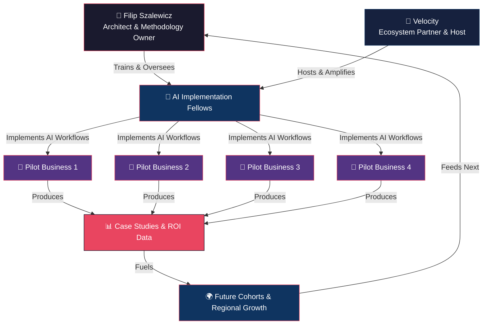

# 🧠 Operational Intelligence Lab

**Building real AI capability in regional businesses — not workshops, not theory, not hype.**

> A working repository — methodology, tools, and source — by **Filip Szalewicz** at [solidcage.com](https://www.solidcage.com).
> The thesis: **rate of improvement is everything.**

---

## Quick Start — start here

| You are a... | Start here |
| --- | --- |
| **Fellow** (technical implementor) | [Fellows Curriculum →](curriculum/fellows/README.md) |
| **Business** (pilot participant) | [Business Track →](curriculum/businesses/README.md) |
| **Velocity / Partner** | [Cohort Zero Overview →](program/cohort-zero-overview.md) |
| **Contributor / Community** | [Contributing Guide →](CONTRIBUTING.md) |
| **Curious about the methodology** | [Rate of Improvement →](docs/methodology/rate-of-improvement.md) |
| **Operator with a metric to bend** | [Live Tracker →](#the-rate-of-improvement-tracker) (no login, browser-only) |

---

## The Problem

Most AI initiatives in regional markets stop at workshops and training. They produce slides, not outcomes. Local businesses hear about AI everywhere but have no clear path to embed it into their operations in a way that moves the needle.

**Macomb County and SE Michigan don't have a Silicon Valley pipeline.** What they have is a dense fabric of industrial, service, and growth-stage businesses that would benefit enormously from operational AI — if someone actually built it with them.

## The Thesis

> **Rate of Improvement is everything.**
>
> Whatever use case we build with AI for any business — in any function — we measure the metric the business already cares about. The rate of improvement on that metric should accelerate rapidly at first, then taper and stabilize. As long as that curve holds, what we built is making a massive, compounding impact.

This repo exists to prove that thesis and give others the tools to replicate it.

---

## What This Is

**Operational Intelligence Lab** is an open playbook for deploying AI inside real businesses to improve real metrics. It contains:

- 📚 **Dual-track curriculum** — one for implementation Fellows, one for participating businesses
- 🧪 **Core methodology** — the Rate of Improvement framework, ROI modeling, and the OI operating model
- 🤖 **Prompts & skills library** — reusable, agent-ready prompts for business analysis, workflow design, and measurement
- 📋 **Templates** — intake questionnaires, progress reports, case studies, ROI reports
- 🏗️ **Program operations** — Cohort Zero structure, financials, timeline, ecosystem design
- 📈 **Live tooling** — the public Rate-of-Improvement Tracker (source in `tracker/`)

The thesis in 60 seconds:

> The **only** honest measure of AI value is whether the operator's chosen
> business metric is improving, and at what rate.

Not the model's metric. The operator's. And not "did it improve once" — at
what rate is it improving, week over week, and is that rate accelerating,
stable, tapering, or stalled?

Everything in this repo serves that thesis:

- The **rate-of-improvement skill** describes the math (slope, half-window
  comparison, classification thresholds).
- The **ROI modeling skill** describes how to translate a rate-of-improvement
  curve into a defensible dollar number for a budget meeting.
- The **AI-employee model skill** describes how to think about AI as a
  capacity-add — an "employee" with a job description, an onboarding plan,
  and a performance review — rather than a tool to be installed.
- The **tracker** makes it operational. Pick a metric. Log it weekly. Read
  the curve.

---

## Ecosystem



---

## Repository Structure

| Path | Purpose |
| --- | --- |
| `curriculum/fellows/` | 12-week Fellow training track (6 modules: AI systems architecture, opportunity modeling, deployment sprint 1, measurement & optimization, deployment sprint 2, executive reporting). |
| `curriculum/businesses/` | Business participant track (4 phases: discovery audit, use-case selection, implementation, measurement & scaling). |
| `program/` | Cohort Zero operations — [overview](program/cohort-zero-overview.md), [timeline](program/timeline.md), [financial structure](program/financial-structure.md), [ecosystem diagram](program/ecosystem-diagram.md), [pitch](program/pitch.md). |
| `docs/methodology/` | Core frameworks — [rate of improvement](docs/methodology/rate-of-improvement.md), [OI framework](docs/methodology/operational-intelligence-framework.md), [ROI modeling](docs/methodology/roi-modeling.md). |
| `prompts/` | Reusable AI prompts (business analysis, implementation, measurement). |
| `skills/` | Agent skill definitions (business data analysis, outcome probability, use-case scoring). |
| `templates/` | Reusable document templates (intake questionnaire, weekly progress report, case study, ROI report). |
| `presentations/` | Slide decks and pitch materials. |
| `tracker/` | React + Vite source for the live Rate-of-Improvement Tracker (mirror of `artifacts/oi-tracker/`). |
| `AGENTS.md` | Top-level operating instructions for any AI agent (Claude, Codex, Devin, internal) working in this repo. |
| `CLAUDE.md` | Claude-specific shortcuts, redirecting to `AGENTS.md`. |
| `CONTEXT.md` | The "why" — the thesis, the audience, the brand promise. |
| `.agents/skills/` | Reusable skills (markdown SOPs) for the three core ideas: rate-of-improvement, ROI modeling, the AI-employee model. |
| `.agents/workflows/` | Step-by-step playbooks: evaluating AI impact on a metric, onboarding a new operator cohort. |
| `CONTRIBUTING.md` | How to contribute. |

---

## The Rate-of-Improvement Tracker

A free, no-login, browser-only tool. The data lives in `localStorage`. The
share link lives in the URL.

**Live demo:** `<DEPLOY_URL>/oi-tracker/` (Replit Deployment — replace `<DEPLOY_URL>` with the live `*.replit.app` host from the project's Publishing tool, or a configured custom domain such as `apps.solidcage.com`). The OI Tracker ships alongside the [Digital Twin Factory Demo Portal](https://github.com/fszale/digital-twin-factory) at `<DEPLOY_URL>/twin-portal/` and the [Agent ROI Generator](https://github.com/fszale/agent-roi-generator) at `<DEPLOY_URL>/agent-roi-generator/`.

### What it does

- Define a metric: name, baseline, target, direction (higher- or
  lower-is-better), cadence.
- Log a value on the cadence — past dates accepted, late check-ins won't
  corrupt the curve.
- Read the dashboard:
  - Cumulative value plotted with target + baseline reference lines.
  - Period-over-period rate of change as a secondary axis.
  - **% to target**, **trailing slope** (linear regression over last 4
    check-ins, in units/day), **projected completion date**, and a
    **trajectory label**: Accelerating / Stable / Tapering / Stalled / Need
    more data.
- Copy a shareable URL — the entire state is encoded into the URL via
  base64-url + pako gzip. No backend involved.

### How it's built

- React + Vite, TypeScript strict.
- shadcn/ui components, Tailwind v4, brand-matched (`#F4F1EC` / `#0E1320` /
  `#EB6928` / `#387CBD`, Inter + JetBrains Mono).
- Recharts for the dual-series curve.
- All math in `tracker/src/lib/calc.ts`. All state I/O in
  `tracker/src/lib/storage.ts`. All sharing in
  `tracker/src/lib/share-link.ts`.
- 34 vitest unit tests covering slope, classification, projection, and
  encode/decode round-trips.

### Run it locally

```bash
cd tracker
pnpm install
pnpm run dev
```

Open the URL printed by Vite. To run the tests:

```bash
pnpm run test
```

To typecheck:

```bash
pnpm run typecheck
```

---

## Reading order for new contributors (and agents)

1. `CONTEXT.md` — why this project exists, what voice it speaks in.
2. `AGENTS.md` — the operating contract for anyone making changes.
3. `.agents/skills/rate-of-improvement/SKILL.md` — the math.
4. `.agents/skills/roi-modeling/SKILL.md` — how to translate that math into
   a budget conversation.
5. `.agents/skills/ai-employee-model/SKILL.md` — how to think about
   capacity, not features.
6. `.agents/workflows/evaluate-ai-impact.md` — the SOP for an evaluation
   engagement.
7. `.agents/workflows/cohort-onboarding.md` — the SOP for onboarding a
   new operator into the OI Lab cohort.
8. `tracker/src/lib/calc.ts` — the source of truth for the math.

---

## Why Open Source

This initiative exists to raise the floor for an entire region. Open-sourcing the playbook means:

1. **Transparency** — Businesses and Fellows see exactly what they're signing up for.
2. **Replicability** — Other regions can fork and adapt.
3. **Community** — The best ideas will come from practitioners in the field.
4. **Accountability** — Public case studies and ROI data keep us honest.

---

## The Model — Cohort Zero

**Cohort Zero** is the pilot: 2 Fellows, 4 businesses, 12 weeks. Tight, focused, measurable.

If it works, we scale. If not, we refine. Either way, we learn in public.

[Read the full Cohort Zero spec →](program/cohort-zero-overview.md)

---

## Talk to Filip

If your team needs help bending the curve — defining the right metric,
running the evaluation, picking the first AI capacity to add — that's
what the Operational Intelligence Lab does.

**Filip Szalewicz** — Architect & Methodology Owner
- 📧 filip.szalewicz@solidcage.com
- 🌐 [solidcage.com](https://www.solidcage.com)
- 📅 [Book a call](https://crm.solidcage.com/widget/bookings/filip-szalewicz-fractional-cto-calendar-vfs0lblxh)

→ **[solidcage.com](https://www.solidcage.com)** — start your AI improvement
journey.

---

## License + posture

The tracker source is published as-is for inspection and learning. The
methodology is an operating practice, not a product — copy what's useful,
attribute what's borrowed.

---

*Built in Macomb County, MI. For the region. For any region.*
