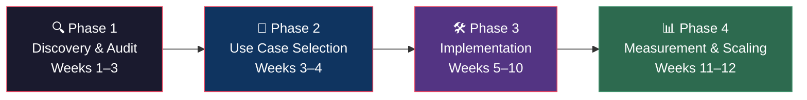

# Business Participant Track

## What This Is

You've been selected as a pilot business for the Operational Intelligence Lab. Over 12 weeks, an AI Implementation Fellow will work alongside your team to embed AI into your operations — targeting a metric you care about and measuring real results.

**This is not a workshop. This is hands-on implementation that produces measurable outcomes.**

## What You Need to Know

### Your Responsibilities

- **Choose the metric**: Tell us what you'd measure if you could improve one thing
- **Provide access**: Staff time (a few hours/week), relevant data, and tool access
- **Stay engaged**: Bi-weekly check-ins with your Fellow
- **Be honest**: Tell us what's working and what isn't

### What You'll Receive

- Comprehensive operational audit
- Custom AI workflow(s) deployed in your operations
- Weekly measurement data
- Final ROI report with annualized projections
- Long-term AI roadmap for your business
- Published case study (anonymized if preferred)

## Your Journey

| Phase | What Happens | Your Time Commitment |
|-------|-------------|---------------------|
| [Discovery & Audit](phase-1-discovery-audit.md) | Fellow observes and maps your operations | 4–6 hours across 2 weeks |
| [Use Case Selection](phase-2-use-case-selection.md) | Together, pick the right problem to solve with AI | 2-hour alignment meeting |
| [Implementation](phase-3-implementation.md) | Fellow builds and deploys AI workflow(s) | 2–3 hours/week for staff onboarding |
| [Measurement & Scaling](phase-4-measurement-scaling.md) | Review results, get your roadmap | 2-hour final presentation |

## The Metric That Matters

Here's the core idea: **you pick the metric. We make it better. And we prove it with data.**

Examples from other businesses:

| Business Type | Metric | What AI Did |
|--------------|--------|-------------|
| Manufacturer | Hours/week on scheduling | Automated production scheduling |
| Service company | Response time to customers | AI-drafted responses + priority routing |
| Retail | Inventory waste | Demand forecasting + auto-reorder |
| Professional services | Hours on reporting | Automated report generation |

## Frequently Asked Questions

**Q: Do we need technical staff?**
No. The Fellow handles all technical work. Your team just needs to continue doing their jobs and provide feedback.

**Q: Will this disrupt our operations?**
The Fellow integrates into your existing tools and processes. There's no new platform to learn. Some staff will spend a few hours learning the new workflow.

**Q: What happens after 12 weeks?**
You keep everything that was built. You'll also receive a roadmap for continuing AI adoption independently or with future cohort support.

**Q: What if it doesn't work?**
We measure weekly. If the data shows the approach isn't working, we pivot. We'd rather find out in Week 4 and adjust than pretend until Week 12.
