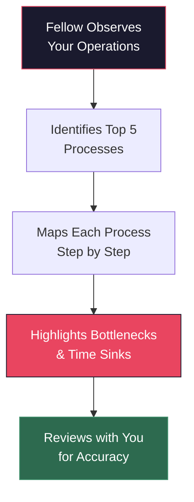

# Phase 1: Discovery & Audit

> **Duration**: Weeks 1–3 | **Your time commitment**: 4–6 hours total

## What Happens

Your assigned Fellow will spend time understanding how your business actually operates — not from a slide deck, but from observation and conversation.

### Week 1: The Shadow Walk

The Fellow will spend 2–4 hours in your business observing day-to-day operations. Think of it as a job shadow, not an audit. They're looking for:

- **Repetitive tasks** — What does your team do over and over every day?
- **Tool switching** — Where do people move between systems (email → spreadsheet → CRM)?
- **Time sinks** — Which activities take the most time relative to their value?
- **Pain points** — Where do you hear "I wish we didn't have to..."?

### Week 2–3: Process Mapping

The Fellow documents what they observed into a clear process map. You'll review this together to make sure it's accurate.

## What You Need to Provide

| Item | Why |
|------|-----|
| Access to your workplace | Fellow needs to observe real operations |
| 30 min with key staff | Brief interviews about their daily work |
| 1 hour with you (owner/manager) | Share your biggest operational frustrations |
| Any existing process docs | Saves duplicate effort (if available) |

## What You'll Receive

By the end of Phase 1:
- A clear **process map** of your key operations
- A **bottleneck report** showing where time and money are being lost
- An initial list of **AI opportunities** ranked by potential impact

## What This Does NOT Involve

- No software to install
- No logins or accounts to set up
- No disruption to daily operations
- No homework or prep work

This is about **understanding**, not changing anything — yet.

---

**Next**: [Phase 2 — Use Case Selection →](phase-2-use-case-selection.md)
