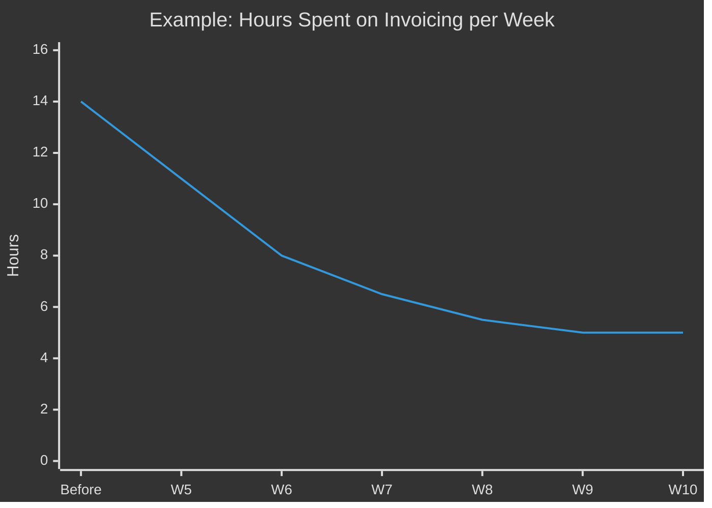

# Phase 3: Implementation

> **Duration**: Weeks 5–10 | **Your time commitment**: 2–3 hours/week

## What Happens

This is where the AI goes to work. Your Fellow builds and deploys AI workflows directly into your operations — using your existing tools, your real data, and your actual processes.

### What to Expect

**Weeks 5–6: First Workflow Goes Live**
- Fellow builds the AI workflow based on the use case you selected
- It integrates into tools your team already uses (email, spreadsheets, CRM, etc.)
- Your team gets a brief walkthrough on how it works

**Weeks 7–8: Monitoring & Refining**
- Fellow collects performance data every week
- Your team provides feedback on what's working and what's not
- Adjustments are made quickly — this is intentionally iterative

**Weeks 9–10: Second Workflow (Optional)**
- If the first workflow is performing well, a second one may be deployed
- This targets either an adjacent process or a new business function

### Your Team's Experience

The AI workflow is designed to reduce work, not add it. Here's what your staff should expect:

| Week | What Staff Experiences |
|------|----------------------|
| Week 5 | Brief demo + training (45 min). Start using the new workflow |
| Week 6 | Getting comfortable. Fellow available for questions |
| Week 7 | Workflow feels normal. Staff notices time savings |
| Week 8 | Providing feedback on what to improve |
| Week 9–10 | Running smoothly. Second workflow may be introduced |

### How We Measure Progress

Every week, the Fellow tracks the metric you chose. You'll see a simple chart like this:

**What you want to see**: The number goes down fast at first, then levels off. That means the AI is delivering consistent, stable value.

## What You Need to Do

| Your Action | When | How Much Time |
|------------|------|---------------|
| Attend staff training session | Week 5 | 45 minutes |
| Make relevant data accessible | Week 5 | 1 hour (one-time) |
| Bi-weekly check-in with Fellow | Every 2 weeks | 30 minutes |
| Share feedback (what's working/not) | Ongoing | As needed |

## What You Don't Need to Do

- ❌ Learn new software platforms
- ❌ Hire technical staff
- ❌ Change your existing processes dramatically
- ❌ Worry about AI "breaking things" — there's always a human review layer

## If Something Isn't Working

It's better to surface problems early. If your team feels frustrated, confused, or like the AI workflow isn't helping — **tell the Fellow immediately**. The whole point of weekly measurement is to catch issues fast and adjust. A pivot in Week 7 is fine. Discovering a problem in Week 12 is not.

---

**Previous**: [← Phase 2 — Use Case Selection](phase-2-use-case-selection.md)
**Next**: [Phase 4 — Measurement & Scaling →](phase-4-measurement-scaling.md)
