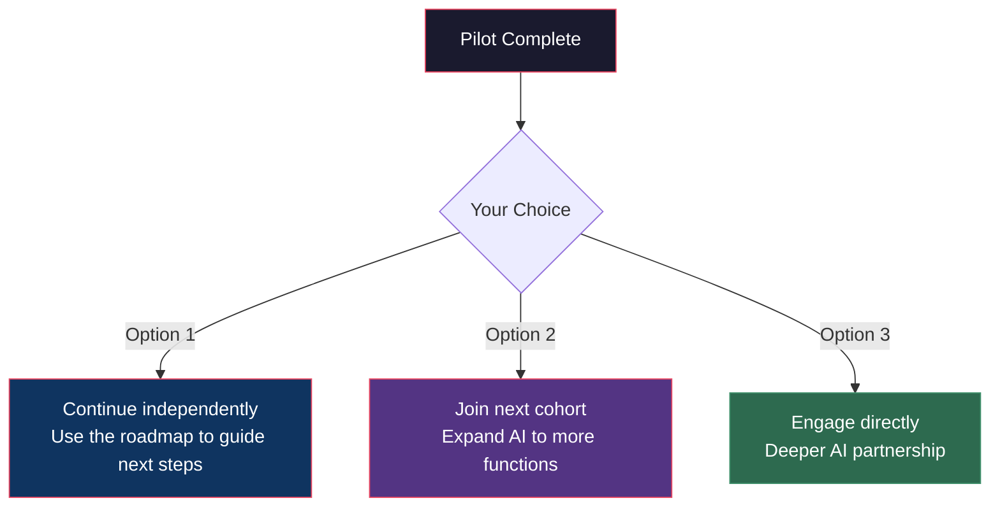

# Phase 4: Measurement & Scaling

> **Duration**: Weeks 11–12 | **Your time commitment**: ~2 hours (final presentation)

## What Happens

The pilot is wrapping up. Your Fellow compiles all the data, produces your final reports, and delivers a presentation with clear results and a recommended path forward.

### What You'll Receive

By the end of Week 12, you'll have a complete package:

| Document | What It Contains |
|----------|-----------------|
| **ROI Report** | Before/after comparison, total value delivered, annualized projection |
| **Rate of Improvement Analysis** | Chart showing how the metric improved over time |
| **Case Study** | Your story — the problem, the solution, the results (anonymized if preferred) |
| **AI Roadmap** | 12-month recommendation for continuing AI adoption |

### Understanding Your Results

The Fellow will walk you through your Rate of Improvement curve. Here's what the patterns mean:

| You See This | It Means | Recommendation |
|-------------|----------|---------------|
| 📈 Fast rise, then levels off | **Great outcome.** AI is delivering stable, ongoing value | Keep it running. Add more use cases |
| 📈 Steady, moderate rise | **Solid outcome.** Value is building but hasn't peaked yet | Continue measuring. May still accelerate |
| 📉 Rose then declined | **Needs attention.** Something changed — adoption, data quality, process | Investigate root cause, adjust |
| ➡️ Flat from start | **Didn't work for this use case.** | Valuable learning. Try a different metric or approach |

### The Final Presentation

Your Fellow will deliver a 30-minute presentation covering:

1. **Executive summary** (2 min) — Bottom line: what changed
2. **Before/After data** (5 min) — Hard numbers, not opinions
3. **The Rate of Improvement curve** (5 min) — Visual proof of trajectory
4. **What was built** (5 min) — Plain-language explanation of the AI workflows
5. **What it's worth** (5 min) — Annualized value and ROI multiple
6. **What's next** (8 min) — 12-month roadmap recommendation

## After the Pilot

### What You Keep

Everything. The AI workflows built during the pilot are yours. They continue running after the Fellow engagement ends.

### What's Next — Three Options

1. **Continue independently**: Use the roadmap and documentation to guide your next AI steps internally
2. **Join the next cohort**: Expand AI adoption with a new Fellow and new use cases
3. **Direct engagement**: Partner directly for deeper, more ambitious AI integration

### The Case Study

Your experience becomes part of the public knowledge base (with your approval). This case study helps:
- Other businesses see what's possible
- Future Fellows learn from real deployments
- The region build its AI capability

**Your success story fuels the next one.**

---

**Previous**: [← Phase 3 — Implementation](phase-3-implementation.md)
**Back to start**: [← Business Track Overview](README.md)
