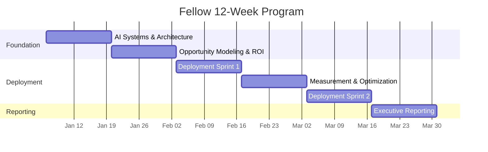

# Fellows Curriculum — 12-Week Track

## Who Are Fellows?

AI Implementation Fellows are **high-agency, technically minded individuals** selected to learn the Operational Intelligence methodology and deploy it hands-on inside real businesses.

Fellows are not consultants who write reports. They are practitioners who **build and embed AI workflows** that produce measurable outcomes.

## Selection Criteria

- Strong technical aptitude (does not need to be a developer)
- Bias toward action and experimentation
- Comfortable with ambiguity and rapid iteration
- Effective communicator with business stakeholders
- Located in or willing to work within the Macomb / SE Michigan region

## What Fellows Learn

By the end of the 12-week program, Fellows will be able to:

1. Map business processes and identify automation leverage points
2. Score opportunities for AI readiness and business impact
3. Design and deploy AI workflows using current-generation tools
4. Measure results using the Rate of Improvement framework
5. Produce executive-quality ROI reports and case studies
6. Recommend long-term AI roadmaps for businesses

## 12-Week Arc

## Weekly Modules

| Module | Weeks | Focus | Key Deliverable |
|--------|-------|-------|----------------|
| [AI Systems & Architecture](week-01-02-ai-systems-architecture.md) | 1–2 | AI foundations, process mapping, bottleneck diagnostics | Process map for assigned businesses |
| [Opportunity Modeling & ROI](week-03-04-opportunity-modeling.md) | 3–4 | Scoring, risk assessment, ROI modeling, exec alignment | Opportunity scorecard + ROI estimate |
| [Deployment Sprint 1](week-05-06-deployment-sprint-1.md) | 5–6 | Build and embed first AI workflow | Working AI workflow in production |
| [Measurement & Optimization](week-07-08-measurement-optimization.md) | 7–8 | Data collection, refinement, friction resolution | Rate of Improvement data + optimized workflow |
| [Deployment Sprint 2](week-09-10-deployment-sprint-2.md) | 9–10 | Second automation, documentation, stabilization | Second AI workflow deployed |
| [Executive Reporting](week-11-12-executive-reporting.md) | 11–12 | ROI analysis, case studies, roadmap | Final case study + ROI report |

## How This Track Works

- **Weekly sessions with Filip**: 1-on-1 or paired sessions covering methodology, troubleshooting, and strategy
- **Hands-on from Week 1**: Fellows are assigned to 2 pilot businesses immediately
- **Deliverables, not homework**: Every module produces a real artifact used in the business engagement
- **No fluff, no certification**: This is about demonstrated capability, not credentials
