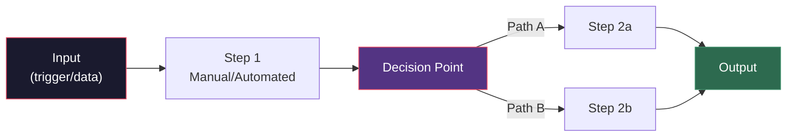

# Week 1–2: AI Systems & Workflow Architecture

## Objectives

By the end of Week 2, Fellows will:
- Understand AI as an operational capability (not a product)
- Map business processes with sufficient detail for automation targeting
- Identify bottlenecks and automation leverage points
- Complete initial diagnostics for their 2 assigned businesses

## Key Concepts

### The AI Employee Model

Traditional: *"Here's an AI tool — go find uses for it."*
OI Approach: *"Here's your biggest operational bottleneck — let's see if AI can be the employee that fixes it."*

The AI Employee model means:
- AI performs a **defined role** within an existing process
- It has **inputs** (data, triggers) and **outputs** (actions, decisions, content)
- It is **always on** — not a tool someone opens when they remember
- It is **measured** on the same metrics as a human employee would be

### Process Mapping Framework

For each step, document:
1. **Who** does it (role, not person)
2. **How long** it takes
3. **How often** it happens
4. **What can go wrong**
5. **What data is involved**

### Operational Bottleneck Diagnostics

A bottleneck is any step where:
- Time accumulates disproportionately
- Errors cluster
- Work queues form
- Staff express frustration
- The business owner says "I wish we could just..."

## Hands-On Exercises

### Exercise 1: Shadow Walk
Spend 2–4 hours observing operations at each assigned business. Take notes on:
- What processes repeat daily?
- Where do people switch between tools/systems?
- What takes the most time relative to its value?
- Where are decisions made on "gut feel" vs. data?

### Exercise 2: Process Map Construction
Using the framework above, create a detailed process map for the top 3 processes identified during the Shadow Walk. Include time estimates and error frequency where available.

### Exercise 3: Bottleneck Heat Map
Rank all mapped process steps on two axes: time consumed vs. business impact. Use this to create an initial priority list for AI intervention.

## Deliverables

| Deliverable | Format | Due |
|------------|--------|-----|
| Process maps for 2 businesses | Mermaid diagrams + narrative | End of Week 1 |
| Bottleneck heat map | Scored table | End of Week 2 |
| Initial metric selection | 1-page summary per business | End of Week 2 |

## Resources

- [Operational Intelligence Framework](../../docs/methodology/operational-intelligence-framework.md)
- [Process Audit Prompt](../../prompts/business-analysis/process-audit.md)
- [Bottleneck Identification Prompt](../../prompts/business-analysis/bottleneck-identification.md)
- [Business Intake Questionnaire](../../templates/business-intake-questionnaire.md)
