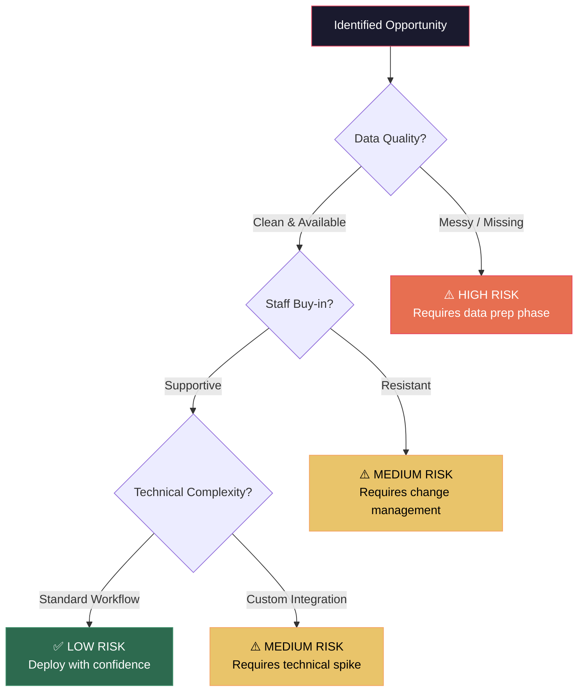

# Week 3–4: Opportunity Modeling & ROI

## Objectives

By the end of Week 4, Fellows will:
- Score automation candidates using a structured rubric
- Evaluate implementation risk for each opportunity
- Build preliminary ROI models for selected use cases
- Conduct executive alignment meetings with business stakeholders

## Key Concepts

### Automation Candidate Scoring

Not every bottleneck is a good AI candidate. Use this scoring matrix:

| Factor | Weight | 1 (Low) | 3 (Medium) | 5 (High) |
|--------|--------|---------|------------|----------|
| Time consumed | 30% | < 2 hrs/week | 2–10 hrs/week | > 10 hrs/week |
| Repetitiveness | 20% | Unique each time | Partially patterned | Highly repetitive |
| Error frequency | 20% | Rare errors | Occasional errors | Frequent errors |
| Business impact | 20% | Low-stakes | Moderate value | Revenue-critical |
| Data availability | 10% | No structured data | Partial data | Rich, clean data |

**Composite Score = Σ (Factor Score × Weight)**

Scores above 3.5 are strong candidates. Scores below 2.5 should be deprioritized.

### Risk Evaluation Framework

### ROI Modeling

Follow the approach in [ROI Modeling Guide](../../docs/methodology/roi-modeling.md):

1. **Quantify current state** — hours, errors, costs
2. **Estimate improvement** — conservative, expected, optimistic
3. **Calculate payback period** — when does value exceed $10K pilot cost?
4. **Present three scenarios** — always lead with conservative

### Executive Alignment Meeting

This is the most critical meeting in the entire engagement. The business owner must:
- **Agree on the metric** that will be tracked
- **Commit resources** (staff time for onboarding, data access)
- **Understand the timeline** — when they'll see results and when they won't
- **Sign off on the approach** — which use case, which workflow

**Meeting agenda template:**
1. Present findings from process mapping (5 min)
2. Walk through top 3 opportunities with scores (10 min)
3. Show ROI model for recommended use case (5 min)
4. Discuss metric selection and baseline measurement (10 min)
5. Agree on next steps and start date for deployment (5 min)

## Hands-On Exercises

### Exercise 1: Opportunity Scorecard
Complete the scoring matrix for all identified bottlenecks from Weeks 1–2. Rank by composite score.

### Exercise 2: Risk Assessment
Run each top candidate through the risk evaluation framework. Document mitigation strategies for any medium/high risks.

### Exercise 3: ROI Model Build
Using the [ROI Estimation Prompt](../../prompts/business-analysis/roi-estimation.md), create a 3-scenario ROI model for the top candidate at each business.

### Exercise 4: Mock Executive Alignment
Practice the alignment meeting with Filip or fellow peer before delivering to the business.

## Deliverables

| Deliverable | Format | Due |
|------------|--------|-----|
| Opportunity scorecard (all candidates) | Scored table with commentary | End of Week 3 |
| ROI model (top candidate per business) | 3-scenario spreadsheet or doc | End of Week 3 |
| Risk assessment | Decision tree + mitigation plan | End of Week 4 |
| Executive alignment meeting notes | Summary with agreed next steps | End of Week 4 |

## Resources

- [ROI Modeling Guide](../../docs/methodology/roi-modeling.md)
- [ROI Estimation Prompt](../../prompts/business-analysis/roi-estimation.md)
- [Use Case Scoring Skill](../../skills/use-case-scoring.md)
