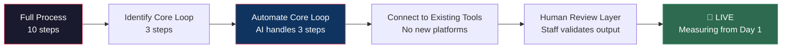

# Week 5–6: Deployment Sprint 1

## Objectives

By the end of Week 6, Fellows will:
- Design and build the first AI workflow for each assigned business
- Integrate the workflow into the business's daily operations
- Onboard staff who interact with the AI workflow
- Begin baseline measurement for the Rate of Improvement framework

## Key Concepts

### Minimal Viable Automation (MVA)

The goal is **not** to build the perfect solution. It's to get a working AI workflow into production as fast as possible so we can start measuring.

**MVA principles:**
- Automate the **repetitive core**, not the edge cases
- Use **existing tools** (email, spreadsheets, CRM) as integration points
- Keep a **human in the loop** for decisions the AI isn't confident about
- Deploy within **days**, not weeks

### Integration Patterns

Common integration approaches for small/mid businesses:

| Business Tool | Integration Method | Example |
|--------------|-------------------|---------|
| Email (Gmail/Outlook) | AI reads/drafts/responds | Auto-draft customer replies |
| Spreadsheets | AI processes/generates data | Automated reporting from raw data |
| CRM (HubSpot, etc.) | API or Zapier connection | Lead scoring and routing |
| Documents | AI generates/reviews/extracts | Invoice processing, contract review |
| Chat/Slack | AI bot or alert system | Real-time operational notifications |
| Phone/Voicemail | AI transcription + action | Call summarization and task creation |

### Staff Onboarding Protocol

The AI workflow is only as good as the team's willingness to use it. Follow this protocol:

1. **Demo, don't explain** — Show the workflow in action on real data
2. **Let them break it** — Give staff 30 minutes to try edge cases
3. **Address fears directly** — "This doesn't replace you. It handles [specific task] so you can focus on [higher value work]."
4. **Assign a champion** — One staff member becomes the go-to person for this workflow
5. **Create a feedback channel** — Staff needs a way to report issues or suggestions

## Hands-On Exercises

### Exercise 1: Workflow Blueprint
Using the [Workflow Design Prompt](../../prompts/implementation/workflow-design.md), create a detailed blueprint for the AI workflow:
- Input triggers
- Processing steps
- Output format
- Error handling
- Human review points

### Exercise 2: Build & Test
Build the workflow using appropriate tools (API integrations, no-code platforms, custom scripts). Test with historical data before going live.

### Exercise 3: Integration Checkpoint
Using the [Integration Planning Prompt](../../prompts/implementation/integration-planning.md), verify that the workflow connects to existing tools without requiring staff to change their daily habits.

### Exercise 4: Staff Onboarding Session
Conduct a 45-minute onboarding session with affected staff. Document reactions, concerns, and any workflow adjustments needed.

## Deliverables

| Deliverable | Format | Due |
|------------|--------|-----|
| Workflow blueprint | Technical specification | End of Week 5 |
| Working AI workflow | Deployed in production | End of Week 5 |
| Staff onboarding notes | Meeting summary + feedback | End of Week 6 |
| Baseline measurement | First 2 weeks of data | End of Week 6 |
| Weekly progress report | [Template](../../templates/weekly-progress-report.md) | Weekly |

## Resources

- [Workflow Design Prompt](../../prompts/implementation/workflow-design.md)
- [Integration Planning Prompt](../../prompts/implementation/integration-planning.md)
- [Rate of Improvement Framework](../../docs/methodology/rate-of-improvement.md)
- [Weekly Progress Report Template](../../templates/weekly-progress-report.md)
