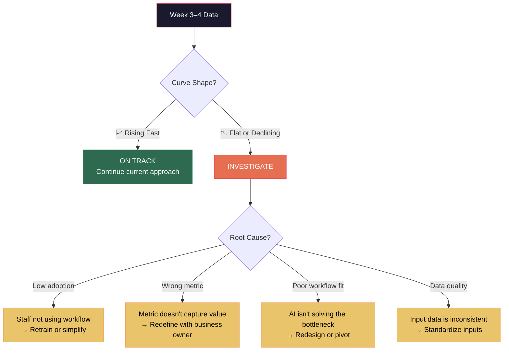

# Week 7–8: Measurement & Optimization

## Objectives

By the end of Week 8, Fellows will:
- Collect and analyze 4+ weeks of performance data
- Compute and visualize the Rate of Improvement curve
- Identify and resolve friction points in the deployed workflow
- Optimize the AI workflow based on real usage data

## Key Concepts

### The Measurement Cadence

Consistent measurement is non-negotiable. Every deployed workflow must have:

| Element | Frequency | Responsibility |
|---------|-----------|---------------|
| Metric data collection | Daily (automated if possible) | Fellow + AI workflow |
| Weekly rollup | Every Friday | Fellow |
| Rate of Improvement calculation | Weekly | Fellow |
| Business owner check-in | Bi-weekly | Fellow |

### Reading the Rate of Improvement Curve

By Week 7, you should have enough data to see the curve taking shape.

### Optimization Strategies

| Issue | Signal | Response |
|-------|--------|----------|
| Staff bypass the workflow | Usage metrics drop | Simplify interface, address concerns, embed deeper |
| Output quality declining | Error rate increasing | Refine prompts, add guardrails, check input data |
| Diminishing returns too early | Curve flattens before expected | Check if ceiling is structural (process limit) vs. solvable |
| Unexpected high performance | Improvement exceeds projections | Validate measurement, then document as case study highlight |

### Handling Resistance

Resistance is normal. Common patterns:

1. **"It's faster to do it myself"** → Usually true in Week 1. Track time over 4 weeks; the data will prove otherwise.
2. **"I don't trust the AI's output"** → Add a visible review step. Let staff catch and correct errors. Confidence builds over time.
3. **"This isn't my job"** → Clarify that the workflow reduces their workload, not increases it.
4. **"What if it makes a mistake?"** → Show the error rate data. Compare AI errors to human error baseline.

## Hands-On Exercises

### Exercise 1: Data Analysis
Compile all metric data from Weeks 3–7. Calculate weekly improvement percentages and rate of improvement.

### Exercise 2: Curve Visualization
Plot the Rate of Improvement curve using a charting tool. Compare to the expected S-curve shape. Document deviations and hypotheses.

### Exercise 3: Friction Audit
Interview 2–3 staff members who interact with the workflow daily. Document:
- What's working well?
- What's frustrating?
- What would they change?

### Exercise 4: Optimization Sprint
Based on data and feedback, implement 1–3 targeted improvements to the workflow. Measure impact in the following week.

## Deliverables

| Deliverable | Format | Due |
|------------|--------|-----|
| Rate of Improvement data table | Spreadsheet with weekly data | End of Week 7 |
| Rate of Improvement curve (visual) | Chart/graph | End of Week 7 |
| Friction audit summary | Interview notes + action items | End of Week 8 |
| Optimization changelog | List of changes made + rationale | End of Week 8 |
| Updated ROI projection | Revised model based on actual data | End of Week 8 |

## Resources

- [Rate of Improvement Framework](../../docs/methodology/rate-of-improvement.md)
- [KPI Tracking Prompt](../../prompts/measurement/kpi-tracking.md)
- [Rate of Improvement Analysis Prompt](../../prompts/measurement/rate-of-improvement-analysis.md)
