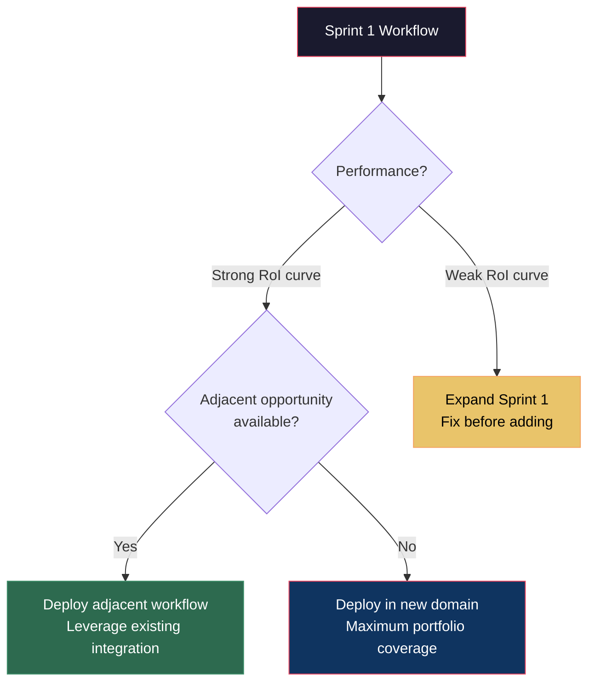

# Week 9–10: Deployment Sprint 2

## Objectives

By the end of Week 10, Fellows will:
- Deploy a second AI workflow at each assigned business
- Apply lessons learned from Sprint 1 to accelerate Sprint 2
- Document both workflows for future replication
- Stabilize both integrations for handoff readiness

## Key Concepts

### Sprint 2 Is Different from Sprint 1

By now, Fellows have 8 weeks of field experience. Sprint 2 should move faster and land cleaner.

| Dimension | Sprint 1 | Sprint 2 |
|-----------|----------|----------|
| Business relationship | Building trust | Trust established |
| Staff comfort with AI | Skeptical | Warming (or converted) |
| Fellow confidence | Learning | Executing |
| Deployment speed | 1–2 weeks | 3–5 days |
| Measurement setup | Manual | Partially automated |

### Choosing the Second Use Case

Options for the second workflow:

1. **Expand**: Deepen the first workflow — handle edge cases, add automation layers
2. **Adjacent**: Automate a connected process (e.g., if the first automated invoicing, now automate payment reconciliation)
3. **New domain**: Tackle a different business function entirely

**Decision framework:**

### Documentation Standard

Every deployed workflow must be documented for three audiences:

| Audience | Document | Purpose |
|----------|----------|---------|
| Fellow successor | Technical spec | Enable future Fellows to maintain/modify |
| Business staff | User guide | Day-to-day usage instructions |
| Case study reader | Impact summary | Quantified results for external showcase |

### Stabilization Checklist

Before moving to Week 11, confirm:

- [ ] Both workflows running for 2+ weeks without manual intervention
- [ ] Staff can operate workflows without Fellow assistance
- [ ] Error handling covers 90%+ of edge cases
- [ ] Monitoring/alerting in place for failures
- [ ] Business owner has visibility into performance data
- [ ] Handoff documentation complete

## Hands-On Exercises

### Exercise 1: Sprint 2 Scoping
Using lessons from Sprint 1, scope the second workflow. Aim for deployment in 5 working days.

### Exercise 2: Rapid Build
Build and deploy the second workflow. Apply the MVA approach from Sprint 1 but move faster.

### Exercise 3: Documentation Blitz
Create all three audience-level documents for both workflows.

### Exercise 4: Stabilization Testing
Run both workflows simultaneously for a full work week. Monitor for conflicts, resource issues, or staff confusion.

## Deliverables

| Deliverable | Format | Due |
|------------|--------|-----|
| Sprint 2 scope document | 1-page brief | Start of Week 9 |
| Second AI workflow deployed | Live in production | Mid-Week 10 |
| Technical documentation (both workflows) | Markdown docs | End of Week 10 |
| Staff user guides (both workflows) | Simple how-to docs | End of Week 10 |
| Stabilization checklist (completed) | Checklist | End of Week 10 |

## Resources

- [Workflow Design Prompt](../../prompts/implementation/workflow-design.md)
- [Integration Planning Prompt](../../prompts/implementation/integration-planning.md)
- [Weekly Progress Report Template](../../templates/weekly-progress-report.md)
