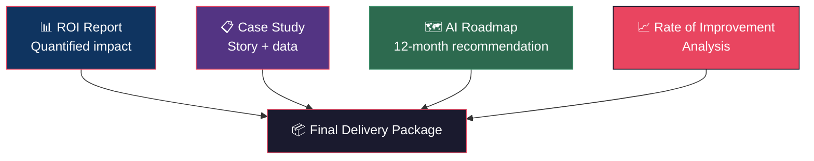

# Week 11–12: Executive Reporting

## Objectives

By the end of Week 12, Fellows will:
- Produce a complete ROI analysis for each business
- Create publication-ready case studies
- Deliver a long-term AI roadmap recommendation to each business
- Present findings at a cohort showcase event

## Key Concepts

### The Final Report Stack

Each business engagement produces four final documents:

### ROI Analysis Components

The final ROI report synthesizes 12 weeks of data:

1. **Before/After Snapshot**: Clear comparison of the metric before and after AI deployment
2. **Total Value Delivered**: Cumulative dollar value produced during the pilot
3. **Annualized Projection**: What this value looks like over 12 months at current trajectory
4. **Cost vs. Return**: $10K investment vs. measured returns
5. **Rate of Improvement Curve**: Visual proof the deployment is working and stable

### Case Study Structure

Case studies are the **most important output** for the ecosystem. They fuel future cohorts and build Velocity's reputation.

Use the [Case Study Template](../../templates/case-study-template.md):

1. **Company profile** (anonymized if requested)
2. **The problem** — what was broken before AI
3. **The approach** — what was built and how
4. **The results** — hard numbers, before/after
5. **The Rate of Improvement curve** — visual proof
6. **Key learnings** — what worked, what didn't
7. **Quote from business owner** — social proof

### Long-Term Roadmap

The 12-week pilot is the beginning, not the end. Every business receives a recommended roadmap:

| Timeframe | Recommendation |
|-----------|---------------|
| **Month 4–6** | Stabilize current workflows, expand to 1 adjacent process |
| **Month 7–9** | Introduce AI to a new function (e.g., marketing → finance) |
| **Month 10–12** | Evaluate fully autonomous workflows where applicable |
| **Year 2+** | Build internal AI capability, reduce dependency on external Fellows |

### Showcase Presentation

All case studies are presented at a cohort showcase event hosted by Velocity. This event:
- Demonstrates tangible results to the broader community
- Recruits businesses for future cohorts
- Establishes Fellows as proven practitioners
- Positions Velocity as the regional AI capability hub

## Hands-On Exercises

### Exercise 1: ROI Report
Build the final ROI report using actual data and the [ROI Report Template](../../templates/roi-report-template.md).

### Exercise 2: Case Study Draft
Write the case study for each business. Include quantitative data and at least one direct quote from the business owner.

### Exercise 3: Roadmap Presentation
Create a 5-slide roadmap deck for each business. Practice delivering it in under 10 minutes.

### Exercise 4: Showcase Dry Run
Practice the showcase presentation. Each Fellow presents 2 case studies (one per business) in 7 minutes each.

## Deliverables

| Deliverable | Format | Due |
|------------|--------|-----|
| ROI report (per business) | [Template](../../templates/roi-report-template.md) | End of Week 11 |
| Case study (per business) | [Template](../../templates/case-study-template.md) | End of Week 11 |
| Long-term AI roadmap (per business) | 5-slide recommendation | End of Week 12 |
| Showcase presentation | 7-minute presentation per business | End of Week 12 |

## Resources

- [ROI Report Template](../../templates/roi-report-template.md)
- [Case Study Template](../../templates/case-study-template.md)
- [Rate of Improvement Analysis Prompt](../../prompts/measurement/rate-of-improvement-analysis.md)
- [Rate of Improvement Framework](../../docs/methodology/rate-of-improvement.md)
