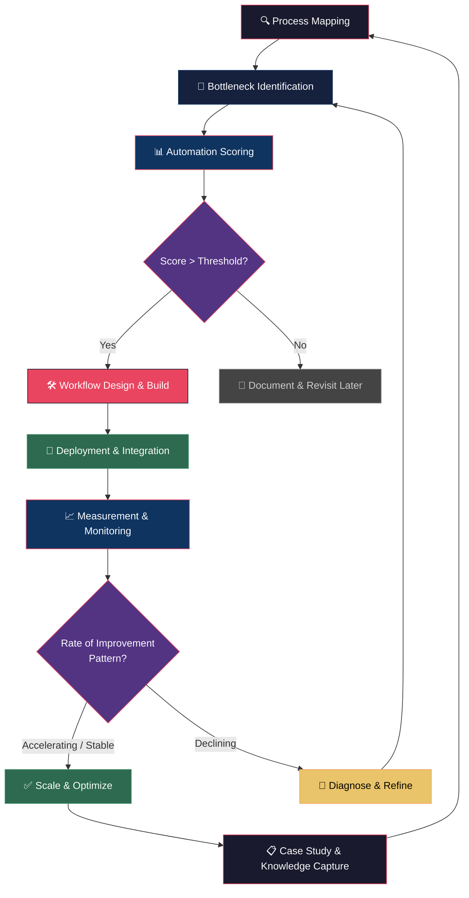
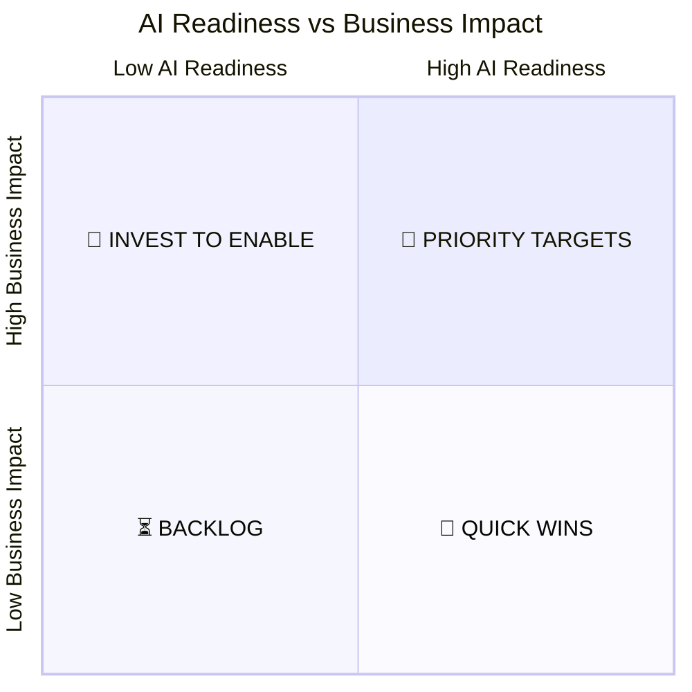

# Operational Intelligence Framework

## What is Operational Intelligence?

Operational Intelligence (OI) is the practice of embedding AI directly into business operations — not as a tool people visit, but as a **persistent capability** that runs alongside (or replaces) existing workflows.

> **AI is not a tool. It is an operational employee.**

The difference matters. A tool sits idle until someone picks it up. An operational employee is always working, always contributing, always improving the process it's embedded in.

## The OI Operating Model

## The Five Stages

### Stage 1: Process Mapping

Before any AI is introduced, we map the business's operational processes in detail.

**Key activities:**
- Interview process owners and frontline staff
- Document inputs, outputs, decision points, and handoffs
- Identify time sinks, manual steps, and repetitive patterns
- Quantify cycle times and error rates

**Deliverable:** Process map with annotated bottlenecks and time data

### Stage 2: Bottleneck Identification

Not every process needs AI. We identify the highest-leverage points where automation or augmentation would create the most value.

**Scoring criteria:**
| Factor | Weight | Description |
|--------|--------|-------------|
| Time consumed | 30% | Hours/week spent on this process |
| Error frequency | 20% | How often mistakes occur |
| Repetitiveness | 20% | How pattern-based the work is |
| Business impact | 20% | Revenue/cost tied to this process |
| Data availability | 10% | Is structured data available to train/feed AI? |

### Stage 3: Automation Scoring

Each identified bottleneck gets scored for AI readiness:

- **Priority Targets** (high readiness + high impact): Do these first
- **Quick Wins** (high readiness + low impact): Easy to deploy, good for momentum
- **Invest to Enable** (low readiness + high impact): Worth preparing data/systems
- **Backlog** (low readiness + low impact): Revisit later

### Stage 4: Workflow Design & Deployment

Design the AI workflow using the principle of minimal viable automation:

1. Start with the smallest useful unit of work the AI can take over
2. Integrate it into existing tools where possible (not new platforms)
3. Keep a human in the loop for the first iteration
4. Measure from day one

### Stage 5: Measurement & Continuous Loop

Apply the [Rate of Improvement framework](rate-of-improvement.md) to every deployment. The measurement loop never stops — it's what separates an embedded capability from a one-time project.

## Principles

1. **Embed, don't bolt on** — AI should live inside existing workflows, not require new tools
2. **Measure what the business cares about** — Not AI metrics, business metrics
3. **Start with the bottleneck** — Don't look for problems AI can solve; find the biggest problem and assess if AI fits
4. **Ship fast, iterate faster** — The first deployment is never final. The Rate of Improvement curve tells you when to adjust
5. **Document everything** — Every deployment produces a case study. Every case study accelerates the next cohort
