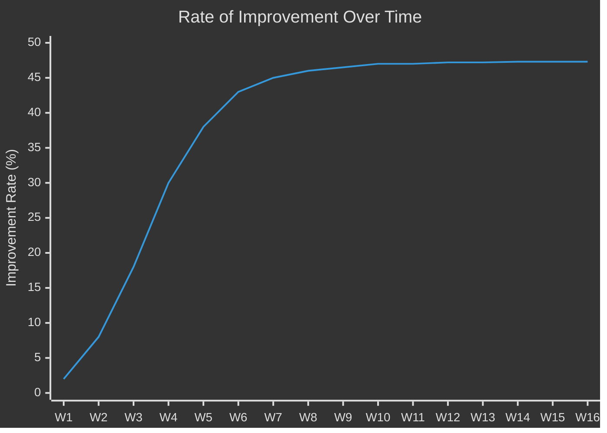
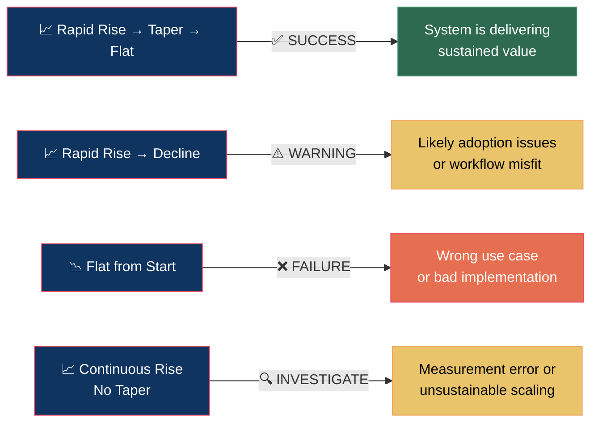

# Rate of Improvement — The Central Metric Thesis

## Core Idea

> Whatever use case we build with AI for any business — in any function — we measure the metric the business already cares about. **The rate of improvement on that metric is the true measure of success.**

This is not about whether AI "works." It's about whether the thing we built is creating compounding, measurable impact over time.

## Why Rate of Improvement, Not Just Improvement

A one-time improvement (e.g., "we saved 10 hours this week") is anecdotal. It doesn't tell you whether the system is learning, scaling, or degrading. **Rate of improvement** captures the trajectory:

- **Is the impact accelerating?** (System is learning / users are adopting)
- **Is it stabilizing?** (System reached optimal performance — this is good)
- **Is it declining?** (Something broke, drift occurred, or the use case was wrong)

## The Expected Curve

**Three phases:**

| Phase | Weeks | What Happens |
|-------|-------|-------------|
| **Rapid Acceleration** | 1–4 | Initial AI workflow deployed. Quick wins captured. Rate of improvement spikes. |
| **Tapering** | 5–10 | System optimizes. Marginal gains decrease but absolute performance is high. |
| **Stabilization** | 11+ | Rate flattens. The AI workflow is now normalized into operations. Steady-state value. |

### What Each Shape Tells You

## Mathematical Framework

### Definitions

Let **M(t)** be the business metric at time **t** (e.g., hours spent on invoicing, error rate, response time).

- **Improvement at time t**: `I(t) = M(t₀) - M(t)` (for metrics you want to decrease) or `I(t) = M(t) - M(t₀)` (for metrics you want to increase)
- **Rate of Improvement**: `RoI(t) = ΔI / Δt` — the change in improvement per unit time
- **Normalized Rate**: `RoI_norm(t) = RoI(t) / M(t₀)` — expressed as percentage of baseline

### Success Criteria

| Signal | Condition | Interpretation |
|--------|-----------|---------------|
| ✅ Strong success | RoI > 0 and decreasing slope (concave curve) | Rapid gains tapering to stable value |
| ✅ Stable success | RoI ≈ 0 after initial gains | System reached optimal steady state |
| ⚠️ Concern | RoI < 0 after initial gains | Improvement reversing — investigate |
| ❌ Failure | RoI ≈ 0 from start | No measurable impact |

## Validation Framework for Cohort Zero

### How We Test This Thesis

1. **Baseline measurement** (Week 1): Record the chosen metric's current state across all 4 pilot businesses
2. **Weekly data collection** (Weeks 2–12): Track the metric at consistent intervals
3. **Compute RoI curve**: Plot improvement rate over time for each business
4. **Pattern matching**: Compare each curve against the expected S-curve shape

### Statistical Validation

For Cohort Zero (n=4), we use descriptive and visual analysis:

- **Per-business curve fit**: Does the improvement trajectory follow the expected concave shape?
- **Cross-business comparison**: Do all 4 businesses show similar curve shapes despite different metrics?
- **Coefficient of determination (R²)**: Fit a logistic/sigmoid curve to each business's data. R² > 0.85 suggests the thesis holds.

### Scaling Validation (Future Cohorts)

With more data (n > 20), we can apply:
- **Paired t-tests**: Pre/post metric comparison with significance testing
- **Regression analysis**: Model the relationship between implementation variables and improvement rates
- **Cohort comparison**: Do later cohorts reach stabilization faster? (methodology improvement signal)

## Practical Application

### For Fellows

When you're embedded in a business:

1. **Week 1**: Ask the business owner: *"What is the one metric you would improve if you could?"*
2. **Quantify the baseline**: Get hard numbers. Not "we waste too much time" but "we spend 14 hours/week on invoice reconciliation."
3. **Deploy the AI workflow** targeting that metric
4. **Measure weekly**: Same metric, same method, same cadence
5. **Plot the RoI curve**: Show it to the business owner. This is your proof of impact.

### For Businesses

You don't need to understand the math. Here's what matters:

- You pick the metric you care about
- We measure it before we start
- We measure it every week after deployment
- The chart should go up fast, then level off at a high point
- If it does, the AI is working. If it doesn't, we adjust.

## Why This Matters for the Region

If we can demonstrate — with public data — that Rate of Improvement follows a predictable, positive pattern across diverse businesses and use cases, we prove something powerful:

**AI operational deployment is not speculative. It is measurable, predictable, and replicable.**

That data becomes the basis for scaling from Cohort Zero to regional transformation.
