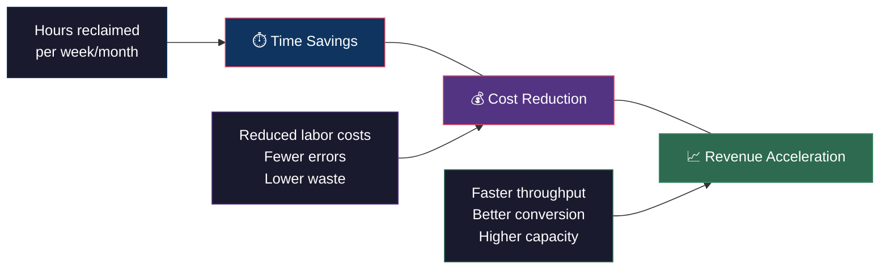

# ROI Modeling

## Purpose

Every pilot business needs a clear, quantified picture of return on investment before, during, and after AI deployment. This document defines how Fellows and businesses calculate and communicate ROI.

## ROI Categories

AI deployments typically produce value across three dimensions:



## Pre-Deployment ROI Estimation

Before building anything, estimate the value of the proposed AI workflow.

### Step 1: Quantify the Current State

| Metric | How to Measure | Example |
|--------|---------------|---------|
| Time spent | Hours/week on the target process | 14 hrs/week on invoice reconciliation |
| Error rate | Errors per 100 transactions | 8 errors per 100 invoices |
| Cost | Fully loaded labor cost for the process | $35/hr × 14 hrs = $490/week |
| Throughput | Units processed per time period | 200 invoices/week |

### Step 2: Estimate Improvement

Based on similar use cases and AI capability assessment:

| Scenario | Time Reduction | Error Reduction | Confidence |
|----------|---------------|-----------------|------------|
| Conservative | 30% | 40% | High |
| Expected | 50% | 60% | Medium |
| Optimistic | 70% | 80% | Low |

### Step 3: Calculate Expected ROI

```
Annual Value = (Hours Saved/Week × Hourly Cost × 52) + (Error Reduction Value × 52)

Example (Expected Scenario):
- Time: 7 hrs/week saved × $35/hr × 52 = $12,740/year
- Errors: 4.8 fewer errors/week × $50/error × 52 = $12,480/year
- Total Expected ROI: $25,220/year

vs. Pilot Cost: $10,000
ROI Multiple: 2.5x in Year 1
```

## During-Deployment Tracking

### Weekly ROI Dashboard

Fellows track these metrics weekly during the 12-week pilot:

| Week | Metric Before | Metric After | Improvement | Rate of Improvement |
|------|--------------|-------------|-------------|-------------------|
| 1 | (baseline) | — | — | — |
| 2 | 14 hrs | 12 hrs | 14% | — |
| 3 | 14 hrs | 9 hrs | 36% | +22% |
| 4 | 14 hrs | 7 hrs | 50% | +14% |
| ... | ... | ... | ... | ... |

### Key Formulas

- **Weekly Improvement %**: `((Baseline - Current) / Baseline) × 100`
- **Rate of Improvement**: `This week's improvement % - Last week's improvement %`
- **Cumulative Value**: `Sum of (Hours Saved × Hourly Rate) across all weeks`

## Post-Deployment ROI Report

The final ROI report (produced in Week 12) includes:

1. **Executive Summary**: One-paragraph business impact statement
2. **Baseline vs. Final State**: Side-by-side comparison with hard numbers
3. **Total Value Delivered**: Cumulative savings/gains over the pilot period
4. **Annualized Projection**: Expected full-year value at current performance levels
5. **Rate of Improvement Curve**: Visual proof of trajectory
6. **Recommendations**: Scale, expand, or adjust

Use the [ROI Report Template](../templates/roi-report-template.md) for standardized formatting.

## Common Pitfalls

| Pitfall | Why It's Dangerous | How to Avoid |
|---------|-------------------|-------------|
| Measuring AI metrics, not business metrics | Nobody cares about model accuracy in isolation | Always tie to the metric the business chose |
| One-time measurement | A single snapshot proves nothing | Weekly cadence, 12 weeks minimum |
| Ignoring soft costs | Training time, change management, resistance | Factor in adoption costs in Week 1–3 estimates |
| Overpromising | Destroys trust if results fall short | Always present Conservative scenario alongside Expected |
