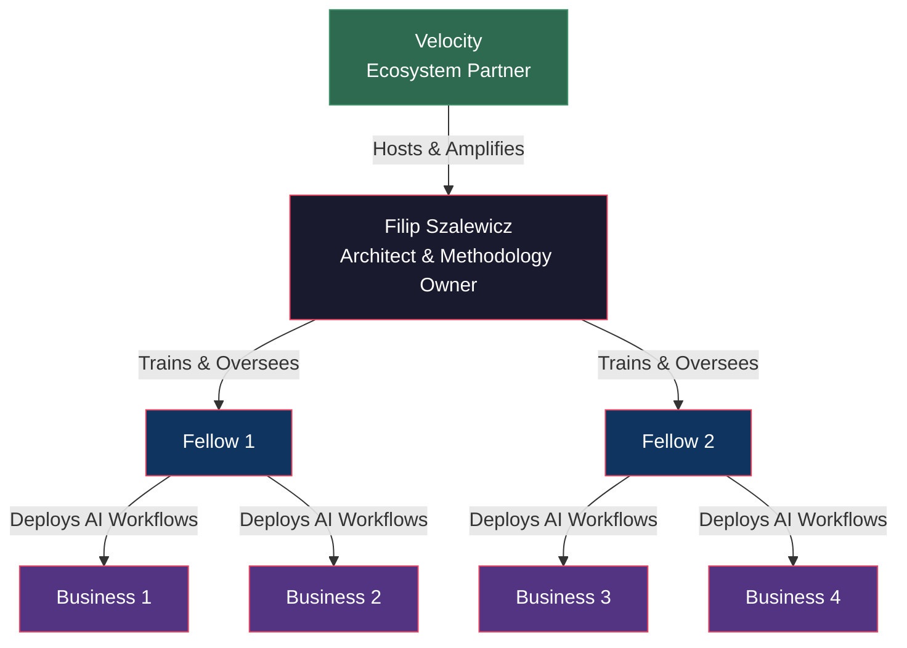

# Cohort Zero — Pilot Overview

## What Is Cohort Zero?

Cohort Zero is the inaugural pilot of the Operational Intelligence Lab — a lean, invite-only program that deploys real AI workflows inside real businesses with measurable outcomes.

**This is not a workshop. This is not a class. This is implementation.**

## Structure

| Component | Details |
|-----------|---------|
| **Fellows** | 2 AI Implementation Fellows |
| **Businesses** | 4 paid pilot businesses (2 per Fellow) |
| **Duration** | 12 weeks |
| **Fee** | $10,000 per business |
| **Location** | Macomb County / SE Michigan |
| **Outcome** | Real AI workflows embedded + ROI documented |

## Why "Cohort Zero"

We call it Cohort Zero because:
- It's the **test** — we're validating the model, not scaling it
- We intentionally start small to move fast and iterate
- AI is evolving weekly — a tight cohort lets us stay current
- Quality of outcomes matters more than quantity of participants

If Cohort Zero succeeds, it becomes the blueprint for Cohort 1, 2, 3... and eventually, a regional standard.

## Selection Criteria

### Fellows
- High-agency, technically capable individuals
- Comfort with ambiguity and fast iteration
- Strong communication skills (they're embedded in businesses)
- Selected jointly by Filip and Velocity

### Businesses
- Operating in Macomb County or SE Michigan
- Willing to commit staff time and data access
- Have a measurable metric they want to improve
- Open to a 12-week engagement with real deliverables
- Able to pay the $10,000 pilot fee

## Success Metrics

| Metric | Target |
|--------|--------|
| AI workflows deployed | ≥ 8 (2 per business) |
| Businesses with positive ROI | 4/4 |
| Rate of Improvement S-curve validated | ≥ 3/4 businesses |
| Case studies published | 4 |
| Showcase event held | 1 |
| Fellows ready for independent engagement | 2/2 |

## What Happens After

If Cohort Zero succeeds:
1. **Case studies** become public proof of impact
2. **The model** is documented and replicable
3. **Cohort 1** launches with more Fellows and businesses
4. **Velocity** becomes the regional hub for operational AI

If Cohort Zero reveals gaps:
1. **We refine** the methodology based on data
2. **We adjust** the financial model if needed
3. **We launch Cohort 1** with improvements

Either way, we learn in public.

## Key Dates

| Milestone | Target |
|-----------|--------|
| Fellow selection | Before program start |
| Business onboarding | Week 0 (pre-program) |
| Program kickoff | Week 1 |
| Mid-point review | Week 6 |
| Final presentations | Week 12 |
| Showcase event | Week 13–14 |
