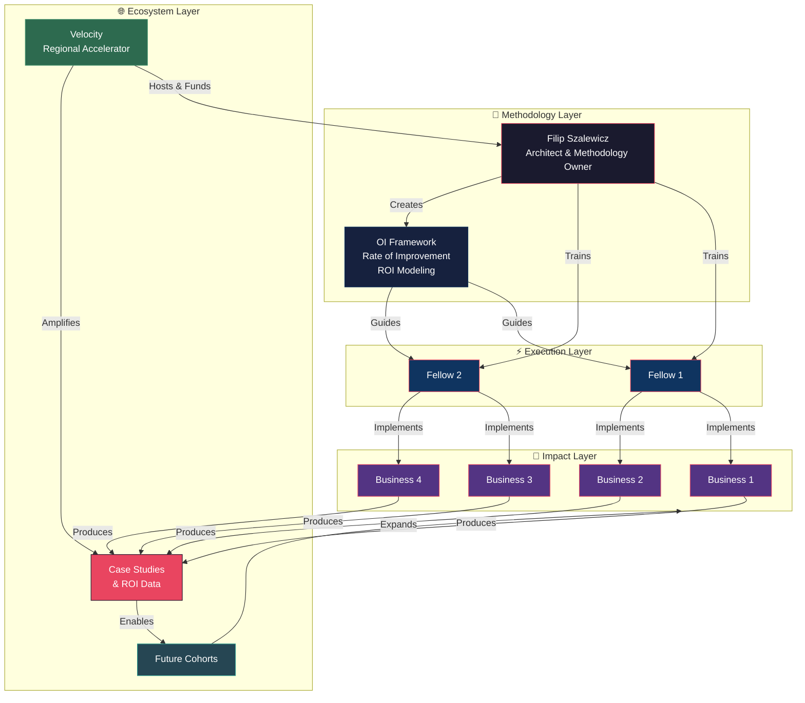
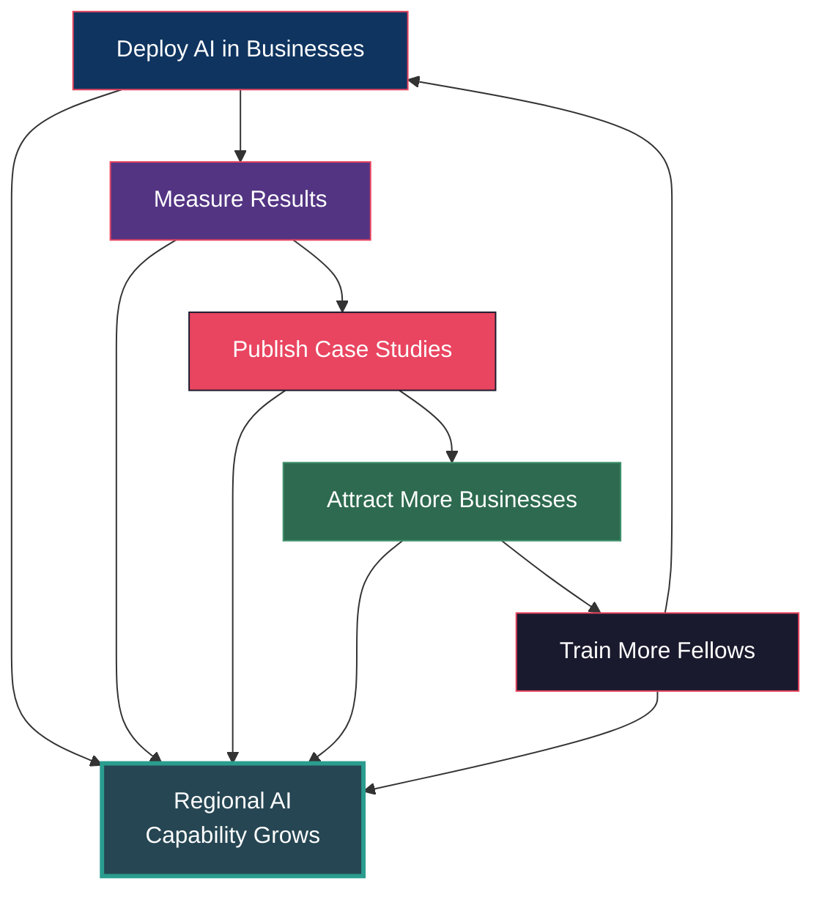

# Ecosystem Diagram

## The Operational Intelligence Ecosystem

## Flow Model

## Value Flows

### For Businesses
`Investment ($10K) → AI Workflows → Measurable ROI → Competitive Advantage`

### For Fellows
`Training + Mentorship → Real Deployment Experience → Career Capability → Independent Practice`

### For Velocity
`Modest Investment → Regional AI Capability → Public Case Studies → Reputation as AI Enablement Hub`

### For the Region
`Proven Model → Replication → Broader Adoption → Economic Competitiveness`

## The Flywheel

