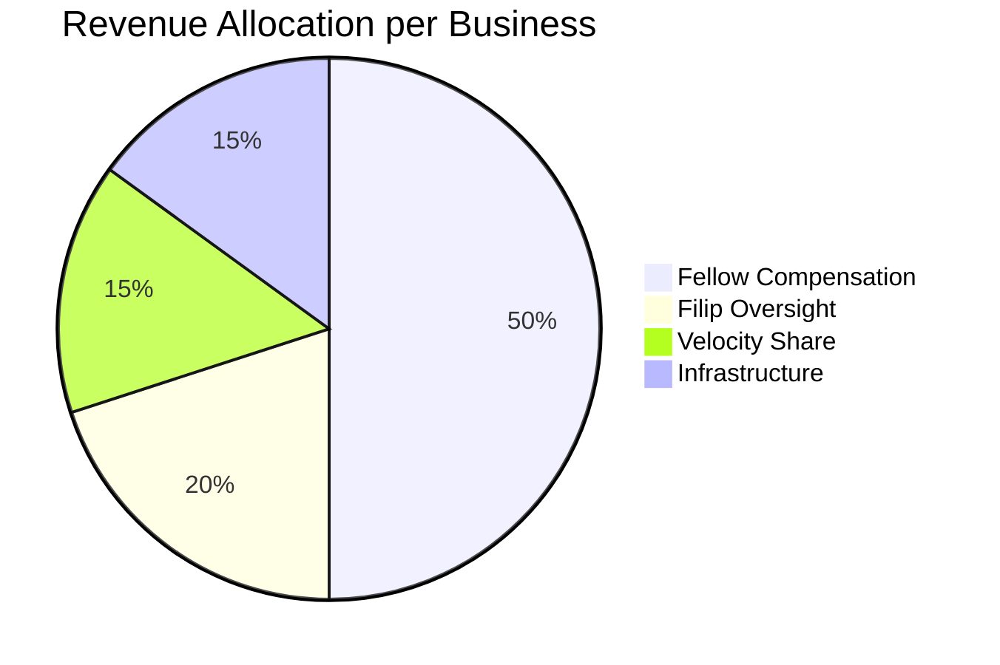

# Financial Structure

## Pilot Fee

**$10,000 per business** | 4 businesses = **$40,000 total revenue**

## Allocation Model

| Component | Per Business | Total (4×) | Purpose |
|-----------|-------------|-----------|---------|
| Fellow Compensation | $5,000 | $20,000 | Direct implementation work (12 weeks) |
| Filip Oversight | $2,000 | $8,000 | Architecture, training, methodology, quality control |
| Velocity Revenue Share | $1,500 | $6,000 | Hosting, ecosystem curation, branding |
| Program Infrastructure | $1,500 | $6,000 | Case study production, tools, admin buffer |
| **Total** | **$10,000** | **$40,000** | |

## Design Principles

1. **Fellows are the biggest investment** — They do the direct work, they deserve the largest share
2. **Filip's share is for architecture, not management** — Methodology design, Fellow training, quality review
3. **Velocity starts modest** — Revenue share can grow as the model scales and Velocity's contribution expands
4. **Infrastructure buffer is real** — Covers tooling, case study production, and unexpected costs

## Revenue Projections by Cohort

| Cohort | Businesses | Revenue | Fellows | Filip Share | Velocity Share |
|--------|-----------|---------|---------|-----------|---------------|
| Zero (Pilot) | 4 | $40,000 | 2 | $8,000 | $6,000 |
| One | 8 | $80,000 | 4 | $16,000 | $12,000 |
| Two | 16 | $160,000 | 8 | $32,000 | $24,000 |

## Business ROI Context

To put the $10,000 investment in perspective:

| Scenario | Annual Value | ROI Multiple |
|----------|-------------|-------------|
| Save 7 hrs/week at $35/hr | $12,740 | 1.3× in Year 1 |
| Save 7 hrs/week + reduce errors | $25,220 | 2.5× in Year 1 |
| Revenue acceleration effect | $40,000+ | 4× in Year 1 |

Most businesses will see payback within the 12-week pilot period under the expected scenario.

## What's Included in the Fee

✅ Full operational audit and process mapping
✅ AI readiness assessment and opportunity scoring
✅ 2 AI workflows designed, built, and deployed
✅ 12 weeks of measurement and optimization
✅ Staff onboarding and training
✅ Final ROI report with annualized projections
✅ Published case study
✅ 12-month AI roadmap recommendation

## What's NOT Included

❌ Ongoing maintenance (post-pilot support is separate)
❌ Software licenses (if specific paid tools are needed)
❌ Hardware or infrastructure costs
❌ Custom software development beyond AI workflow scope
