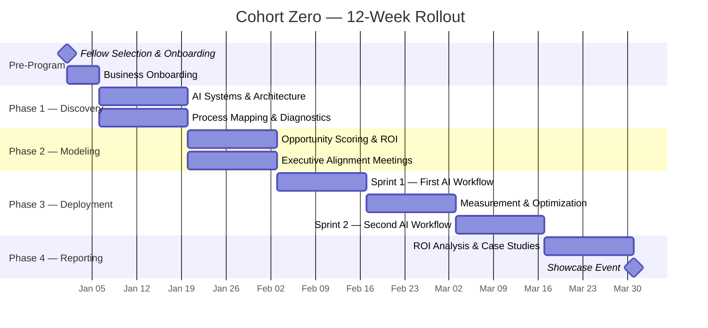

# 12-Week Timeline

## Overview

## Week-by-Week Breakdown

| Week | Phase | Fellow Activities | Business Activities | Key Deliverable |
|------|-------|------------------|--------------------|-----------------| 
| 1 | Discovery | Shadow Walk, process observation | Provide access, initial interviews | Process observations |
| 2 | Discovery | Process mapping, bottleneck scoring | Review process maps for accuracy | Process maps + bottleneck heat map |
| 3 | Modeling | Automation scoring, ROI modeling | Review opportunity options | Opportunity scorecard |
| 4 | Modeling | Executive alignment meeting | Agree on metric + approach | Signed-off use case + baseline |
| 5 | Sprint 1 | Build first AI workflow | Provide data access, tool access | Working AI workflow |
| 6 | Sprint 1 | Staff onboarding, baseline measurement | Staff participates in training | Onboarded team + baseline data |
| 7 | Optimize | Collect data, analyze initial results | Provide feedback on workflow | Week-over-week improvement data |
| 8 | Optimize | Optimize workflow, address friction | Flag any issues | Optimized workflow + RoI curve |
| 9 | Sprint 2 | Scope and build second workflow | Agree on second use case | Second workflow scope |
| 10 | Sprint 2 | Deploy and stabilize second workflow | Staff onboarding for workflow 2 | Two stable AI workflows |
| 11 | Reporting | ROI analysis, case study drafting | Review results, provide quotes | Draft ROI report + case study |
| 12 | Reporting | Final presentations, roadmap delivery | Attend final presentation | Final package delivered |

## Critical Milestones

| Milestone | Week | Success Gate |
|-----------|------|-------------|
| Process maps complete | 2 | Accurate, business-validated process maps |
| Executive alignment | 4 | Business owner agrees on metric and approach |
| First workflow live | 5 | AI processing real business data |
| Mid-point RoI positive | 8 | Rate of Improvement curve showing upward trend |
| Second workflow live | 10 | Both workflows running simultaneously |
| Showcase event | 13 | Case studies presented publicly |

## Cadence

| Activity | Frequency | Participants |
|----------|-----------|-------------|
| Fellow ↔ Filip session | Weekly | Fellow + Filip |
| Fellow ↔ Business check-in | Bi-weekly | Fellow + Business owner |
| Data collection | Weekly | Fellow (automated where possible) |
| Full cohort sync | Monthly | All Fellows + Filip |
